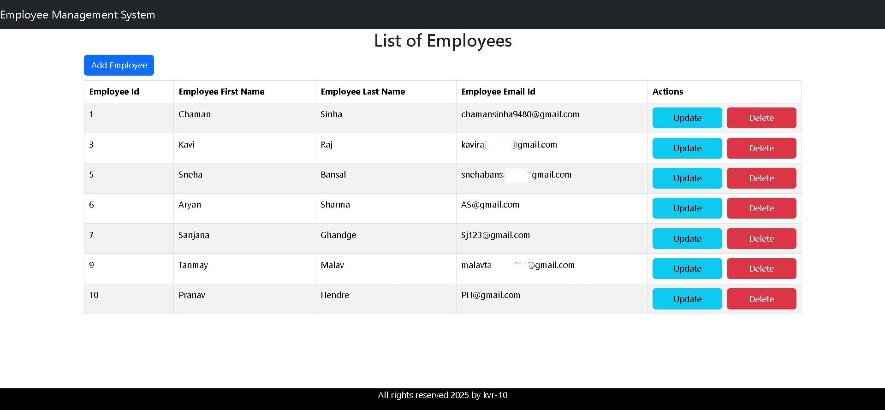
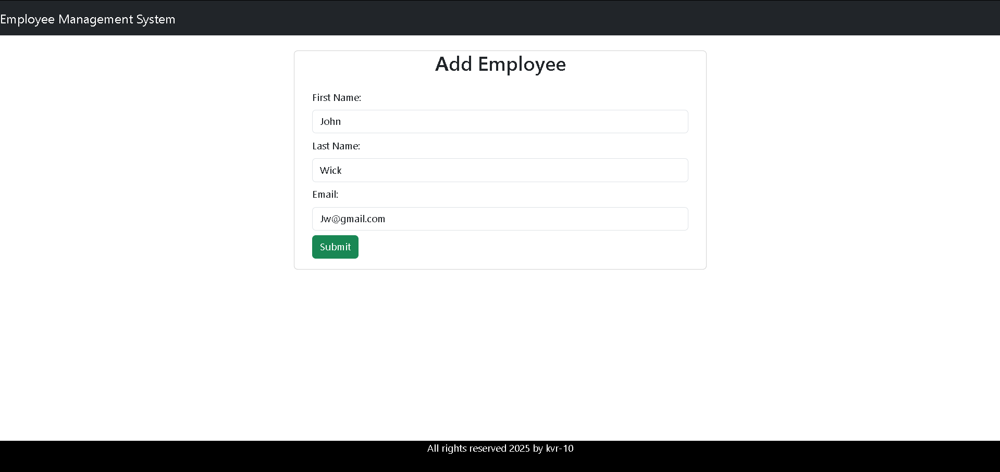
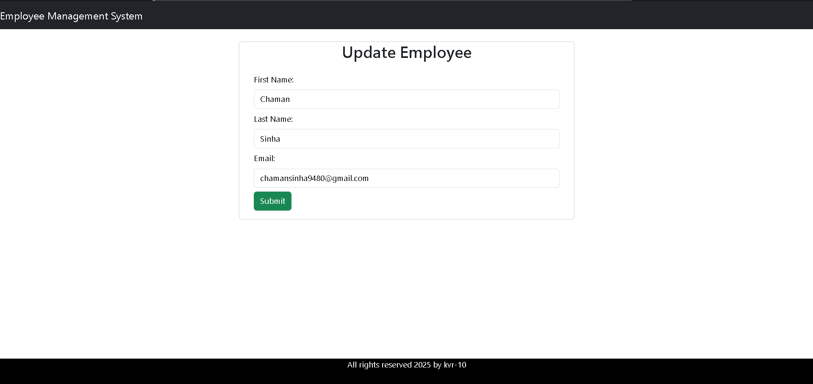

# Employee Management System

A full-stack web application for managing employee data efficiently with Spring Boot backend and React frontend.

## Features

- **Employee Dashboard**: View all employees with pagination and search functionality
- **CRUD Operations**:
  - Add new employee records with validation
  - Edit existing employee details
  - Remove employees from the system
- **Responsive Design**: Works on desktop and mobile devices
- **REST API**: Complete CRUD operations via REST endpoints
- **Database Integration**: MySQL with JPA for data persistence

## Technologies Used

### Backend
- Spring Boot (Java)
- Spring Data JPA
- MySQL
- Maven

### Frontend
- React
- Bootstrap
- Axios

### DevOps & Deployment  
- **CI/CD:** GitHub Actions  
- **Containerization:** Docker  
- **Hosting & Deployment:**  
  - Render (Backend Hosting)  
  - Railway (Database Hosting)  
  - Netlify (Frontend Hosting)  

## Live Demo

[View Live Application](https://ems-springboot-application-kvr10.netlify.app/)

> **Note**: The backend service on Render may take ~50 seconds to respond on first request due to cold start.

## Screenshots





## Installation

### Prerequisites
- Java JDK 17+
- Node.js 16+
- MySQL 8+
- Maven
- npm

## Configure environment variables:

```bash
# Create .env file
echo "DATASOURCE_URL=jdbc:mysql://your-database-url" >> .env
echo "DATASOURCE_USER=your-username" >> .env
echo "DATASOURCE_PASSWORD=your-password" >> .env
echo "FRONTEND_URL=your-frontend-url" >> .env
```

## Build and Run

```bash
mvn clean install
mvn spring-boot:run
```

### Navigate to frontend directory:

```bash
cd ../frontend
```

### Install dependencies and run:

```bash
npm install
npm run dev
```

## API Endpoints

| Method | Endpoint               | Description          |
|--------|------------------------|----------------------|
| GET    | /api/employees         | Get all employees   |
| POST   | /api/employees         | Create new employee |
| GET    | /api/employees/{id}    | Get employee by ID  |
| PUT    | /api/employees/{id}    | Update employee     |
| DELETE | /api/employees/{id}    | Delete employee     |

## Contact

- **Email:** selvamarshall13@gmail.com
- **GitHub:** [@Selva-vignesh-7](https://github.com/Selva-vignesh-7)

